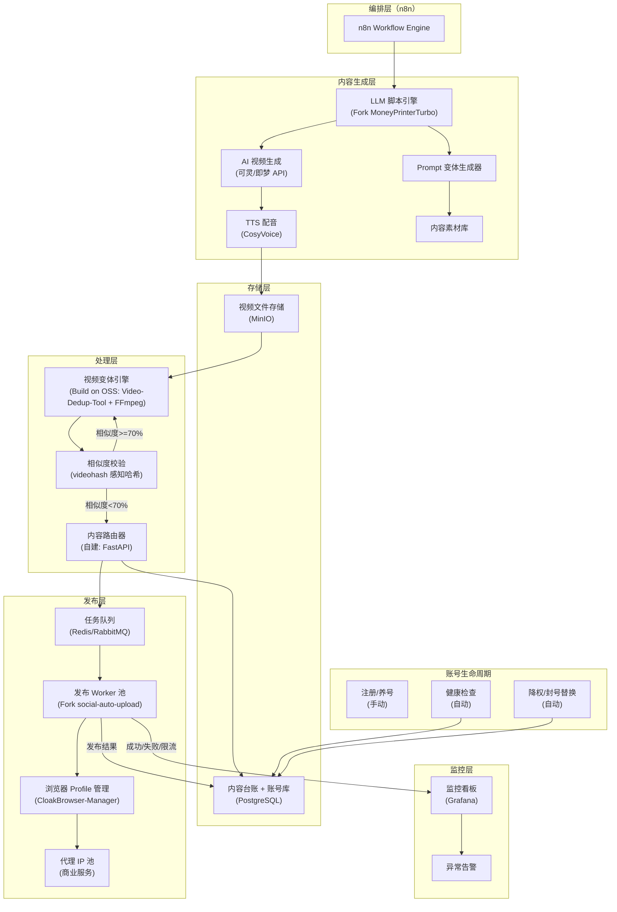
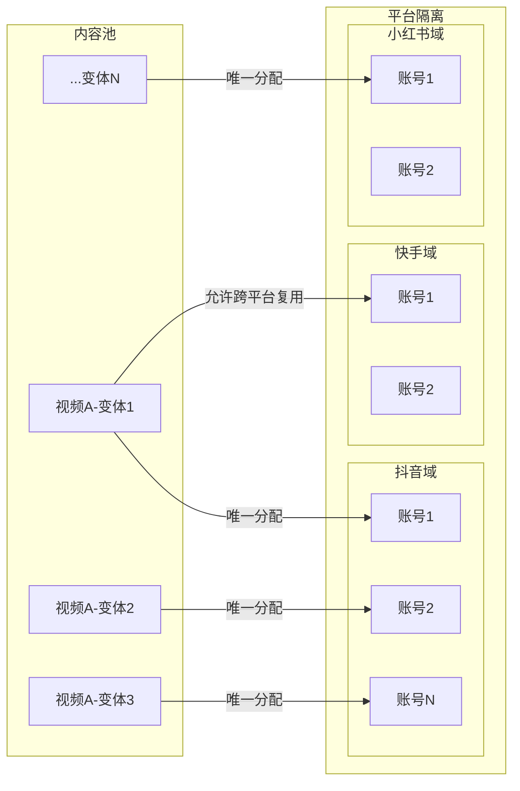
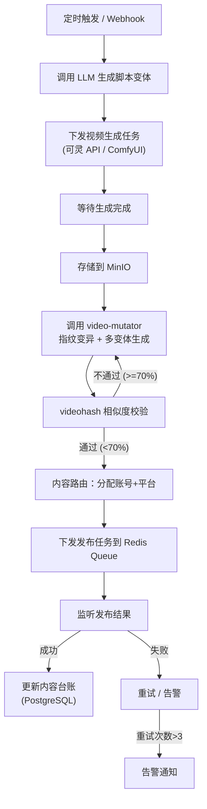

# AI 视频矩阵运营系统 — 终版方案

> 版本：v2.0 (Final Merged)
> 基于：调研驱动方案 (Plan B, research-driven-planner 七阶段) + 原始设计方案 (Plan A) 具体设计
> 日期：2026-03-29

---

## Stage 1: 问题定义

**核心问题**：需要一个系统，能用 AI 批量生成差异化的产品营销视频，并通过 100-1000 个账号自动发布到抖音/快手/小红书/视频号等平台进行引流。

**用户/场景**：产品营销团队，混合型产品（实体+数字），需 7x24 无人值守运营。

**约束**：

- 预算灵活，根据 ROI 决定自建还是买服务
- 从零开始，无现有账号和发布基础
- GPU 资源按需，可用商业 API 或云端 GPU

**成功标准**：

- 每天每个账号发布 3-5 条不重复视频
- 同平台内不同账号内容零重复
- 系统 7x24 稳定运行，异常自动告警
- 单视频综合成本（生成+变体+发布）< ¥15

**前置依赖**：

- 需提前准备手机号/设备用于账号注册和养号（100-1000 账号规模的核心瓶颈）
- 养号周期至少 2-4 周才能正常发布

**不做**：

- 不做直播相关功能
- 不做评论互动（Phase 1）
- 不做数据分析看板（Phase 1）
- 不做账号注册自动化（手动准备）

---

## Stage 2: 搜索空间映射

### 候选方案清单


| #   | 名称                           | 类型  | Stars | 技术栈               | 许可证 | 核心能力                                                                                                | 匹配度        |
| --- | ---------------------------- | --- | ----- | ----------------- | --- | --------------------------------------------------------------------------------------------------- | ---------- |
| 1   | **MoneyPrinterTurbo**        | 开源  | 53.5k | Python            | MIT | LLM 生成脚本 → 素材获取 → TTS → 字幕 → FFmpeg 合成，一键生成短视频                                                      | 高          |
| 2   | **social-auto-upload**       | 开源  | 9.4k  | Python/Playwright | -   | 多平台自动发布（抖音/快手/小红书/视频号/B站/百家号），Cookie 管理                                                             | 高          |
| 3   | **NarratoAI**                | 开源  | 8.4k  | Python            | -   | AI 视频解说 + 自动剪辑，支持 Qwen2-VL 视频理解，语音克隆                                                                | 中          |
| 4   | **short-video-factory**      | 开源  | 3.7k  | Electron          | -   | 跨平台桌面端，一键生成产品营销短视频，AI 批量剪辑                                                                          | 中          |
| 5   | **cxlaike-module-cxlaike**   | 开源  | 129   | Java+Vue          | 学习用 | SaaS 矩阵系统，分钟级生成 1000+ 不重复混剪视频，20+ 平台多账号管理                                                           | 高（参考）      |
| 6   | **flycontent**               | 开源  | 新     | Python            | -   | 全自动内容搬运流水线，多账号镜像，24/7 调度                                                                            | 中          |
| 7   | **AgentCut**                 | 开源  | 新     | Python            | -   | 6-Agent 协作生成视频（导演/编剧/视觉/配音/音乐/剪辑），$0.5/视频                                                           | 中          |
| 8   | **matrix**                   | 开源  | 854   | Python/Playwright | -   | 抖音/快手/视频号/小红书自动发布，MySQL+Redis 多账号                                                                   | 高          |
| 9   | **Fuploader**                | 开源  | 新     | Go+Wails          | -   | 桌面端多账号发布，Cookie 加密，任务队列                                                                             | 中          |
| 10  | **可灵/即梦 API**                | 商业  | -     | REST API          | 商业  | 高质量 AI 视频生成，按 credits 计费                                                                            | 高（Phase 1） |
| 11  | **CloakBrowser**             | 开源  | 新     | C++/Chromium      | -   | 源码级反检测浏览器，33 个 C++ patch（Canvas/WebGL/Audio/字体/GPU 指纹），30/30 bot detection 通过，Playwright drop-in 替代 | **高**      |
| 12  | **CloakBrowser-Manager**     | 开源  | 新     | Docker            | -   | 自托管多账号 Profile 管理（类 Multilogin 开源替代），每 Profile 独立指纹/代理/Session                                      | **高**      |
| 13  | **Video-Dedup-Tool**         | 开源  | 新     | Python/FFmpeg     | -   | 6 维视频去重：水平镜像、RGB 偏移、时间抖动(minterpolate)、MD5 修改、遮罩反转、帧采样                                              | **高**      |
| 14  | **Video-Deduplication-Tool** | 开源  | 新     | Python/FFmpeg     | -   | 精细变体：0.99-1.01x 缩放、±2px 位移、±2% 亮度对比度、rubberband 音频变调                                                | **高**      |
| 15  | **videohash**                | 开源  | 600+  | Python            | MIT | 感知哈希：64-bit 视频指纹，检测缩放/转码/颜色/裁剪/帧率修改后的相似视频                                                           | **高**      |
| 16  | **OpenClaw**                 | 开源  | -     | Python            | -   | 五层自动化体系（素材→剪辑→文案→发布→监控），多账号并发，月成本 ¥350-900                                                          | 中          |


### 关键发现

1. **视频生成和视频发布是两个独立的问题域**，业界也是分开解决的
2. **MoneyPrinterTurbo（53k Stars）** 是视频生成领域的绝对王者，MIT 许可证，Docker 一键部署
3. **social-auto-upload（9.4k Stars）** 是多平台发布领域最成熟的开源方案
4. **cxlaike** 是最接近"完整矩阵系统"的方案，但 Java 技术栈且仅限学习用途
5. 没有一个开源项目同时做好了"生成 + 去重 + 多账号发布"全链路
6. **反检测/指纹隔离**：CloakBrowser 提供了源码级反检测方案，CloakBrowser-Manager 提供了开源版 Multilogin 替代
7. **视频去重工具链成熟**：Video-Dedup-Tool / Video-Deduplication-Tool 可直接作为"视频变体引擎"组件复用
8. **感知哈希校验**：videohash 可用于内容台账发布前校验

---

## Stage 3: 深度剖析 Top 3

### 方案 1：MoneyPrinterTurbo


| 维度    | 信息                                                                                               |
| ----- | ------------------------------------------------------------------------------------------------ |
| 链接    | [https://github.com/harry0703/MoneyPrinterTurbo](https://github.com/harry0703/MoneyPrinterTurbo) |
| Stars | 53,584                                                                                           |
| 许可证   | MIT                                                                                              |
| 技术栈   | Python, Streamlit (Web UI), FastAPI (API), FFmpeg                                                |
| 维护状态  | 活跃（最后更新 2025-12）                                                                                 |


**它如何解决核心问题**：
用 LLM 生成视频脚本，从 Pexels 等素材库自动获取视频/图片素材，用 TTS 生成配音，用 Whisper 生成字幕，最后用 FFmpeg 合成完整视频。

**架构决策分析**：


| 决策点    | 选择            | 理由            | 对我们的启示              |
| ------ | ------------- | ------------- | ------------------- |
| 素材来源   | Pexels 等免费素材库 | 避免版权问题        | 产品营销需要自有素材，此方案不完全适用 |
| LLM 接入 | 12+ 模型抽象层     | 灵活切换          | 好的设计，可复用            |
| 视频合成   | FFmpeg        | 稳定可靠，无 GPU 需求 | 适合后期处理阶段            |
| UI     | Streamlit     | 快速原型          | API 更适合自动化场景        |
| 批量模式   | 有，但串行         | 简单实现          | 需改造为并行              |


**可复用的设计模式**：

1. LLM 抽象层——支持多模型切换的 Provider 模式
2. 视频合成 Pipeline——FFmpeg 参数化合成管线
3. 批量生成接口——API 模式可集成到 n8n

**优势**：53k Stars、MIT 许可、Docker 一键部署、无 GPU 需求、成本极低
**劣势**：素材来源不适合产品营销、无 AI 视频生成（T2V/I2V）能力、无去重/变体机制
**适用边界**：适合泛内容/知识类短视频，不适合需要产品实拍展示的营销视频

---

### 方案 2：social-auto-upload


| 维度    | 信息                                                                                               |
| ----- | ------------------------------------------------------------------------------------------------ |
| 链接    | [https://github.com/dreammis/social-auto-upload](https://github.com/dreammis/social-auto-upload) |
| Stars | 9,400+                                                                                           |
| 许可证   | -                                                                                                |
| 技术栈   | Python, Flask, Playwright, SQLite, Vue 3                                                         |
| 维护状态  | 活跃                                                                                               |


**它如何解决核心问题**：
使用 Playwright 模拟浏览器操作，自动化登录各平台并上传视频。支持抖音、快手、小红书、视频号、B站、百家号 6 大平台。

**架构决策分析**：


| 决策点   | 选择                   | 理由      | 对我们的启示                 |
| ----- | -------------------- | ------- | ---------------------- |
| 自动化引擎 | Playwright           | 跨浏览器、稳定 | 与 stagehand-lab 经验一致   |
| 账号管理  | Cookie + SQLite      | 轻量够用    | 100+ 账号需升级到 PostgreSQL |
| 调度    | Cron Job             | 简单      | 需更灵活的任务队列（Redis）       |
| 前端    | Vue 3 + Element Plus | 管理界面    | 可复用                    |


**可复用的设计模式**：

1. 平台上传器抽象——每个平台独立的 Uploader 类
2. Cookie 管理——自动保存和恢复登录状态
3. 封面自适配——根据平台要求自动裁剪封面

**优势**：9.4k Stars、支持 6 大国内平台、有 Web 管理界面和 API、Playwright 技术栈成熟
**劣势**：单账号串行、无代理 IP 支持、无任务队列、无内容去重机制
**适用边界**：适合少量账号（<10）的自动化发布，需要二次开发支持大规模矩阵

---

### 方案 3：CloakBrowser + Video-Dedup-Tool 生态

> 原 Top 3 中的 cxlaike（129 stars、仅限学习用途）降级为架构参考。

#### 3a. CloakBrowser + CloakBrowser-Manager


| 维度    | 信息                                                                                 |
| ----- | ---------------------------------------------------------------------------------- |
| 链接    | [https://github.com/CloakHQ/CloakBrowser](https://github.com/CloakHQ/CloakBrowser) |
| Stars | 新（2026-03 发布）                                                                      |
| 许可证   | 待确认                                                                                |
| 技术栈   | C++ (Chromium patch), Docker (Manager)                                             |
| 维护状态  | Early Alpha                                                                        |


**它如何解决核心问题**：
33 个源码级 C++ patch 修改 Chromium 的 Canvas、WebGL、Audio、字体、GPU 等指纹，每个浏览器实例呈现独立设备特征。CloakBrowser-Manager 提供 Web UI 管理多个 Profile，Docker 部署。

**可复用的设计模式**：

1. Profile 级隔离——每个账号绑定独立的浏览器 Profile（指纹/代理/Cookie）
2. 集中式 Profile 管理——Web API 创建/启动/停止 Profile
3. Playwright 兼容——无需修改现有 social-auto-upload 代码

**优势**：30/30 bot detection 通过、reCAPTCHA v3 得分 0.9、开源自托管、与 Playwright 兼容
**劣势**：Early Alpha、社区尚小、自定义二进制需维护更新
**适用边界**：大规模多账号隔离的最佳开源选择

#### 3b. Video-Dedup-Tool / Video-Deduplication-Tool + videohash


| 维度    | 信息                                                                                                              |
| ----- | --------------------------------------------------------------------------------------------------------------- |
| 链接    | github.com/sdlw7757/Video-Dedup-Tool, github.com/lzhga-tx/Video-Deduplication-Tool, github.com/akamhy/videohash |
| Stars | 新 / 新 / 600+                                                                                                    |
| 许可证   | - / - / MIT                                                                                                     |
| 技术栈   | Python, FFmpeg, rubberband                                                                                      |
| 维护状态  | 活跃                                                                                                              |


**它如何解决核心问题**：
Video-Dedup-Tool 提供 6 种维度的视频变体处理，专门针对平台去重检测设计。videohash 提供感知哈希校验，用于发布前验证变体差异化程度。

**可复用的设计模式**：

1. 多维变体 Pipeline——视觉/音频/元数据三维独立变异，组合产生指数级差异
2. 发布前感知哈希校验——用 videohash 检测变体与同平台已发内容的汉明距离
3. 阈值化策略——相似度 > 70% 则拒绝发布并重新变体

---

### 架构参考：cxlaike-module-cxlaike

> 降级为架构参考（129 Stars、仅限学习用途、Java 技术栈不匹配），不纳入 Top 3 深度分析。

**值得借鉴的设计模式**：

1. 视频混剪去重算法——素材分片 + 随机重组 + 参数变异
2. 多账号隔离架构——每个账号独立的上传上下文
3. 同平台内容台账——确保同平台不重复

---

### 开源健康度评估

#### MoneyPrinterTurbo 健康度


| 维度     | 权重  | 评分          | 说明                                        |
| ------ | --- | ----------- | ----------------------------------------- |
| 维护活跃度  | 30% | 4/5         | v1.2.6 (2026-05)；近 3 月有 commit；Issue 响应较快 |
| 社区规模   | 20% | 5/5         | 53k+ Stars, 6k+ Fork, 200+ Contributors   |
| 代码质量   | 20% | 4/5         | 有 Docker 部署、模块化结构；无自动化测试                  |
| 文档完整度  | 15% | 4/5         | README 详尽、中英文、安装教程完整；缺 API 文档             |
| 许可证与安全 | 15% | 5/5         | MIT 许可、依赖链干净                              |
| **综合** |     | **4.3/5.0** | **可以放心依赖**                                |


#### social-auto-upload 健康度


| 维度     | 权重  | 评分          | 说明                                 |
| ------ | --- | ----------- | ---------------------------------- |
| 维护活跃度  | 30% | 4/5         | 近 3 月有 commit 和 release；Issue 响应中等 |
| 社区规模   | 20% | 4/5         | 9.4k Stars, 1k+ Fork；有活跃 Issue 讨论  |
| 代码质量   | 20% | 3/5         | 平台适配器抽象良好；但单进程架构、无并发设计             |
| 文档完整度  | 15% | 3/5         | README 说明基本；缺 API 文档和架构说明          |
| 许可证与安全 | 15% | 3/5         | 许可证未明确声明；Cookie 存储安全性一般            |
| **综合** |     | **3.5/5.0** | **可用但需关注风险**（Fork 后需增强安全性和并发能力）    |


---

## Stage 4: 模式提取

### 共识模式


| 模式             | 描述                                 | 出现方案                                       | 我们的行动 |
| -------------- | ---------------------------------- | ------------------------------------------ | ----- |
| Playwright 自动化 | 国内平台无开放 API，全部用 Playwright 模拟浏览器操作 | social-auto-upload, matrix, cxlaike        | 采纳    |
| Cookie 持久化     | 保存登录态避免频繁扫码登录                      | 全部方案                                       | 采纳    |
| LLM 文案生成       | 用 LLM 生成差异化的视频脚本/标题/描述             | MoneyPrinterTurbo, cxlaike, AgentCut       | 采纳    |
| FFmpeg 后处理     | 视频合成、转码、参数调整全部用 FFmpeg             | 全部方案                                       | 采纳    |
| 平台上传器抽象        | 每个平台独立的上传器类，统一接口                   | social-auto-upload, matrix                 | 采纳    |
| Profile 级账号隔离  | 每个账号绑定独立浏览器 Profile（指纹/Cookie/代理）  | CloakBrowser-Manager, OpenClaw             | 采纳    |
| 感知哈希相似度检测      | 用感知哈希（非 MD5）检测视频相似度                | videohash, 平台检测算法                          | 采纳    |
| 多维变体组合         | 视觉+音频+元数据三维独立变异                    | Video-Dedup-Tool, Video-Deduplication-Tool | 采纳    |


### 争议点


| 争议点    | 方案A                     | 方案B                       | 分析                           | 我们的倾向                                                 |
| ------ | ----------------------- | ------------------------- | ---------------------------- | ----------------------------------------------------- |
| 视频生成方式 | 素材拼接（MoneyPrinterTurbo） | AI 原生生成（T2V/I2V）          | 素材拼接成本低但不适合产品展示；AI 生成质量好但成本高 | 混合：产品素材 + AI 增强 + 变体化                                 |
| 去重策略   | 素材重组混剪（cxlaike）         | 参数级变异（FFmpeg）             | 混剪需要大量素材；参数变异成本低但变化有限        | 两层结合：LLM 生成不同脚本 + FFmpeg 参数变异                         |
| 多账号架构  | 客户端运行                   | 服务器端运行                    | 客户端分散压力但管理难；服务器端集中管理但需要资源    | 服务器端 + Docker 部署                                      |
| 反检测方式  | 源码级 patch（CloakBrowser） | JS 注入（playwright-stealth） | 源码级更可靠但依赖自定义二进制              | Phase 2 用 playwright-stealth，Phase 3+ 迁移 CloakBrowser |
| 变体粒度   | 微调式变体（±2%）              | 结构式变体（重新剪辑）               | 微调成本低但可能不够；结构式效果好但成本高        | 分层：微调为默认 + 检测不通过时升级到结构式                               |


### 反模式


| 反模式        | 描述                  | 我们如何避免                            |
| ---------- | ------------------- | --------------------------------- |
| 单进程串行上传    | 100 个账号串行上传极慢       | 多 Worker 并发 + 任务队列                |
| 忽略平台风控     | 同 IP 发布多个账号触发封号     | 代理 IP 池 + 发布间隔 + 设备指纹隔离           |
| 内容完全相同     | 同一视频发多个账号被判抄袭       | 五维变异 + 内容台账 + 平台内隔离               |
| 共享浏览器实例    | 多个账号在同一浏览器实例登录      | Profile 级隔离（CloakBrowser-Manager） |
| 仅 MD5 校验去重 | MD5 无法检测转码/缩放后的相似视频 | 感知哈希（videohash）                   |


### 技术雷达


| 技术/方案                        | 环位         | 理由                            |
| ---------------------------- | ---------- | ----------------------------- |
| MoneyPrinterTurbo            | **Adopt**  | 53k Stars，MIT，成熟稳定            |
| social-auto-upload           | **Adopt**  | 9.4k Stars，国内平台覆盖最全           |
| Playwright 浏览器自动化            | **Adopt**  | 业界共识                          |
| Video-Dedup-Tool / videohash | **Adopt**  | 专门针对平台去重设计                    |
| CloakBrowser                 | **Trial**  | 源码级反检测，30/30 通过，但 Early Alpha |
| ComfyUI + 开源视频模型             | **Trial**  | 有潜力但需要 GPU 且质量待验证             |
| 可灵/即梦 API                    | **Trial**  | 商业 API 质量好但成本需评估              |
| CloakBrowser-Manager         | **Assess** | 多账号 Profile 管理，Early Alpha    |
| cxlaike 架构模式                 | **Assess** | 架构设计可参考，但代码不可用                |
| AgentCut 多 Agent 协作          | **Assess** | 理念先进但项目太新                     |


---

## Stage 5: Build vs Buy 决策

### 子模块评分

> 评分说明：1=强烈倾向 Buy，5=强烈倾向 Build。总分=加权分之和/11。


| 子模块      | 战略差异(3x) | 定制化(2x) | 方案成熟(2x) | 团队能力(2x) | 时间压力(1x) | 维护成本(1x) | 总分  | 决策                                            |
| -------- | -------- | ------- | -------- | -------- | -------- | -------- | --- | --------------------------------------------- |
| LLM 脚本生成 | 3        | 3       | 2        | 4        | 3        | 3        | 2.9 | Fork MoneyPrinterTurbo 的 LLM 抽象层              |
| AI 视频生成  | 2        | 2       | 1        | 2        | 2        | 2        | 1.8 | Buy（先用可灵/即梦 API）                              |
| 视频变体/去重  | 5        | 5       | 2        | 4        | 3        | 4        | 3.5 | Build on OSS（基于 Video-Dedup-Tool + videohash） |
| 视频相似度检测  | 2        | 3       | 1        | 4        | 3        | 2        | 2.4 | Buy+Extend（videohash + 自定义阈值策略）               |
| 多平台发布    | 2        | 4       | 1        | 4        | 2        | 3        | 2.7 | Fork+Extend social-auto-upload                |
| 多账号管理    | 4        | 5       | 3        | 4        | 3        | 4        | 3.9 | Build on OSS（发布调度自建 + CloakBrowser）           |
| 反检测/指纹隔离 | 3        | 4       | 2        | 3        | 2        | 3        | 2.8 | Buy+Extend（CloakBrowser + Manager 自托管）        |
| 代理 IP 池  | 1        | 2       | 1        | 3        | 1        | 1        | 1.5 | Buy（商业代理服务）                                   |
| 内容路由/台账  | 4        | 5       | 4        | 4        | 3        | 3        | 3.9 | Build（核心调度逻辑，自研）                              |
| 视频存储     | 1        | 1       | 1        | 4        | 2        | 1        | 1.5 | Buy（MinIO 自托管）                                |
| 任务队列/调度  | 1        | 1       | 1        | 4        | 2        | 1        | 1.5 | Buy（Redis/RabbitMQ）                           |
| 运营监控     | 1        | 2       | 1        | 3        | 1        | 1        | 1.5 | Buy（Grafana，Phase 2+）                         |


### 决策摘要


| 决策类别             | 子模块      | 具体方案                                    |
| ---------------- | -------- | --------------------------------------- |
| **Buy**          | AI 视频生成  | 可灵/即梦 API（Phase 1），后续评估自建               |
| **Buy**          | 代理 IP 池  | 商业代理服务（Phase 2+切开源 proxy_pool）          |
| **Buy**          | 视频存储     | MinIO 自托管（Docker 部署）                    |
| **Buy**          | 任务队列     | Redis + RabbitMQ（已有基础设施）                |
| **Buy**          | 监控       | Grafana（Phase 2+）                       |
| **Buy+Extend**   | 反检测/指纹隔离 | CloakBrowser + CloakBrowser-Manager     |
| **Buy+Extend**   | 视频相似度检测  | videohash + 自定义阈值策略                     |
| **Fork+Extend**  | LLM 脚本生成 | 复用 MoneyPrinterTurbo 的 LLM Provider 抽象层 |
| **Fork+Extend**  | 多平台发布    | 基于 social-auto-upload 二次开发              |
| **Build on OSS** | 视频变体/去重  | 基于 Video-Dedup-Tool + FFmpeg 自建变体引擎     |
| **Build on OSS** | 多账号管理    | 发布调度自建 + CloakBrowser 浏览器隔离             |
| **Build**        | 内容路由/台账  | FastAPI 服务，核心调度逻辑                       |


---

## Stage 6: 方案设计

### 整体架构




### 关键子系统：内容路由与平台隔离

> 来源：Plan A 设计细节。内容路由是本系统最核心的调度逻辑，需要单独的交互图说明。




**路由规则**：

- **同平台隔离**：同一平台的不同账号，绝不分配相同或相似的视频。用 `content_ledger` 表记录每条内容的分配历史。
- **跨平台允许复用**：抖音账号A用过的视频，可以分配给快手账号B（但仍经过指纹变异）。
- **内容台账**：每条视频分配到哪个平台的哪个账号，全部记录在 PostgreSQL 中。

### 关键子系统：n8n 编排工作流

> 来源：Plan A 设计细节。n8n 作为整个系统的「大脑」，编排全链路。




### 关键数据结构：脚本变体模型

> 来源：Plan A 设计细节。LLM 脚本变体生成器的核心数据结构。

```
Product -> [Script Variant 1, Script Variant 2, ..., Script Variant N]

Script Variant:
  id: str                    # 唯一标识
  product_id: str            # 所属产品
  hook_type: enum            # Hook 类型：提问/悬念/数据/共鸣
  style: enum                # 文案风格：种草/测评/教程/故事
  duration: enum             # 时长：15s/30s/60s
  prompt_text: str           # LLM 生成的视频脚本
  visual_desc: str           # 视觉描述（用于 AI 视频生成 prompt）
  tts_text: str              # TTS 朗读文本
  fingerprint_hash: str      # 内容指纹（videohash 64-bit）
  status: enum               # pending / generating / ready / assigned / published
  assigned_account: str      # 分配到的账号 ID
  assigned_platform: str     # 分配到的平台
```

**五维变异策略**（指纹变异引擎的具体实现）：


| 维度   | 变异手段                          | 实现方式               |
| ---- | ----------------------------- | ------------------ |
| 像素级  | 分辨率/帧率/码率微调、MD5 变更            | FFmpeg 参数化         |
| 画面级  | 随机滤镜/色调/对比度/亮度微调、随机裁剪 1-3% 边缘 | FFmpeg/OpenCV      |
| 音频级  | 不同 TTS 声线、语速微调 ±5-15%、不同 BGM  | CosyVoice + FFmpeg |
| 结构级  | 不同片头/片尾模板、镜头顺序微调、不同过渡效果       | FFmpeg concat      |
| 元数据级 | 不同标题/描述/标签、不同封面图              | LLM 生成 + 脚本        |


### 架构说明

**与调研方案的关键改进**：

1. **存储层**（调研新增）：MinIO 存储视频文件，PostgreSQL 统一管理内容台账和账号库
2. **反馈闭环**（调研新增）：发布结果回写到 PostgreSQL 和 Grafana，驱动自适应调整
3. **CloakBrowser-Manager**（调研新增）：Worker 通过 CloakBrowser-Manager 获取独立 Profile
4. **相似度校验门**（调研新增）：变体后经 videohash 校验，相似度 ≥70% 退回重新变体
5. **账号生命周期**（调研新增）：注册→养号→运营→健康检查→降权替换
6. **内容路由详细设计**（Plan A 补充）：独立的内容路由交互图，明确同平台隔离和跨平台复用规则
7. **编排工作流详细设计**（Plan A 补充）：n8n 编排的完整步骤流，包含校验循环和失败重试

### 关键 ADR

**ADR-001**: 在视频生成方面，面对自建 GPU 推理 vs 商业 API 的选择，我们选择了 Phase 1 使用商业 API（可灵/即梦），以实现快速验证 ROI，接受单位成本较高的代价，因为自建 GPU 前期投入大且 ROI 未验证。

**ADR-002**: 在多平台发布方面，面对从零自建 vs Fork 开源项目的选择，我们选择了 Fork social-auto-upload 并二次开发，以实现快速获得 6 大平台的发布能力，接受需要维护 Fork 分支的代价，因为 9.4k Stars 的项目已验证可行性，且 Playwright 技术栈与团队匹配。

**ADR-003**: 在视频去重方面，面对混剪式去重 vs 参数级变异的选择，我们选择了两层去重策略（LLM 生成差异化脚本 + 基于 Video-Dedup-Tool 的多维参数变异），以实现同平台内零重复，接受需要集成和扩展变体引擎的代价，因为这是矩阵运营的核心差异化能力。

**ADR-004**: 在反检测/指纹隔离方面，面对源码级 patch（CloakBrowser）vs JS 注入（playwright-stealth）的选择，我们选择了分阶段策略——Phase 2 用 playwright-stealth 快速验证，Phase 3+ 迁移到 CloakBrowser，以实现风险分散的渐进引入，接受 Phase 2 可能有检测风险的代价，因为 CloakBrowser 仍为 Early Alpha。

**ADR-005**: 在内容相似度校验方面，面对感知哈希（videohash）vs 自建 CNN 特征提取的选择，我们选择了 videohash 感知哈希，以实现低成本的发布前自检，接受精度可能不及深度学习方案的代价，因为 videohash 的 64-bit 哈希计算快速（无 GPU 需求），且作为"预检门"已足够。

**ADR-006**: 在视频存储方面，面对 MinIO 自托管 vs 云 OSS 的选择，我们选择了 MinIO Docker 自托管，以实现数据自主可控和零云存储成本，接受需要自行维护存储基础设施的代价，因为视频文件量大但访问模式简单，MinIO 的 S3 兼容 API 未来可无缝迁移到云 OSS。

---

## Stage 7: 落地路径

### Phase 1：MVP 验证（3 周）

**目标**：验证"AI 生成视频 → 自动发布到抖音"全链路可行性
**核心假设**：AI 生成的视频质量足够用于产品营销引流
**交付物**：

- Week 1：部署 MoneyPrinterTurbo（Docker），测试 3 种产品的视频生成质量
- Week 1-2：测试可灵/即梦 API 的产品营销视频效果，对比质量和成本
- Week 2-3：部署 social-auto-upload，手动测试发布到 1 个抖音账号（已养号）
- Week 3：搭建 MinIO 存储 + PostgreSQL 内容台账基础表
**验证标准**：
- 能生成可接受质量的产品营销视频（人工评审通过率 > 80%）
- 能自动发布到抖音且不被限流（连续 3 天）
- 单视频生成成本 < ¥10
- 全链路端到端打通（从主题输入到视频发布）
**Go/No-Go**：
- **Go** → 视频质量评审通过 + 发布无异常 + 成本可控 → 进入 Phase 2
- **Pivot** → 质量不达标但素材+AI 增强可行 → 调整生成策略后重新验证
- **No-Go** → 所有方式质量均不可接受 → 项目暂停，重新评估需求

### Phase 2：单平台自动化（4 周）

**前置条件**：Phase 1 Go
**目标**：5 个抖音账号每天各发 3 条不重复视频，全自动运行
**交付物**：

- Week 1-2：集成 Video-Dedup-Tool 构建视频变体引擎（video-mutator）+ videohash 相似度校验门
- Week 2-3：改造 social-auto-upload 支持 5 账号并发 + playwright-stealth 反检测
- Week 3-4：搭建 n8n 全链路编排 + 内容台账同平台隔离逻辑
- Week 4：端到端压力测试 72 小时
**验证标准**：
- 5 个账号连续运行 7 天无封号
- 同平台内视频零重复（videohash 汉明距离 > 阈值）
- 系统无人值守运行 72 小时无异常
- 日均生产 15 条视频（5 账号 x 3 条），全自动
**Go/No-Go**：
- **Go** → 7 天无封号 + 无人值守 72h 稳定 → 进入 Phase 3
- **Iterate** → 封号率 > 0 但 < 40% → 增强变体和频率控制，延长验证期
- **No-Go** → 封号率 > 40% → 退回重新评估反检测方案

### Phase 3：多平台 + 规模化（8 周）

**前置条件**：Phase 2 Go
**目标**：扩展到 4 个平台 x 20 个账号（共 80 个）
**交付物**：

- Week 1-3：扩展到快手/小红书/视频号平台适配器
- Week 2-4：内容路由器（跨平台允许轻微重复 + 同平台严格隔离）
- Week 3-5：商业代理 IP 接入 + CloakBrowser 初步集成（替代 playwright-stealth）
- Week 4-6：账号养号策略 + 账号健康检查自动化
- Week 6-8：监控告警基础能力（Grafana + 发布成功率/封号率/成本仪表盘）
**验证标准**：
- 80 个账号（4 平台 x 20）稳定运行 14 天
- 月封号率 < 5%
- 引流效果可量化（曝光量 / 点击量 / 私信量）
- CloakBrowser 反检测效果优于 playwright-stealth
**Go/No-Go**：
- **Go** → 月封号率 < 5% + 引流 ROI 为正 → 进入 Phase 4
- **Iterate** → 封号率 5-15% → 增强指纹隔离和养号策略
- **No-Go** → 封号率 > 15% 或 ROI 为负 → 收缩规模，优化单账号效率

### Phase 4：千级账号运营（12 周，分 3 子阶段）

**前置条件**：Phase 3 Go
**目标**：扩展到 100-1000 账号，实现规模化运营

**Phase 4a：百级账号（4 周）**

- 扩展到 4 平台 x 50 账号（200 个）
- CloakBrowser-Manager 全量接管 Profile 管理
- 多机分布式 Worker 部署
- 验证：200 账号连续运行 30 天，月封号率 < 3%

**Phase 4b：降成本迁移（4 周）**

- ComfyUI + 开源视频模型（如 Wan2.2 / HunyuanVideo）替代部分商业 API
- 对比质量和成本，确定最优模型组合
- 验证：单视频成本降低 50%+ 且质量不低于商业 API 的 80%

**Phase 4c：千级运营（4 周）**

- 扩展到 500-1000 账号
- 数据驱动的内容优化闭环（A/B 测试不同视频风格/标题/发布时间）
- 运营数据看板（账号健康度、内容效果、成本追踪）
- 自动化账号轮换和替补策略

### 风险矩阵


| 风险               | 概率  | 影响  | 等级  | 应对策略                                              | 触发条件                   |
| ---------------- | --- | --- | --- | ------------------------------------------------- | ---------------------- |
| 平台封号             | 高   | 高   | 红   | 养号期 + IP 隔离 + 频率控制 + CloakBrowser 指纹隔离            | 单日封号率 > 5%             |
| 视频被判重复           | 高   | 高   | 红   | 两层去重 + videohash 校验 + 内容台账 + 持续迭代变异算法             | videohash 相似度告警 > 70%  |
| AI 视频质量不达标       | 中   | 高   | 黄   | Phase 1 先验证；备选素材+AI增强模式                           | 人工评审通过率 < 60%          |
| 商业 API 成本过高      | 中   | 中   | 黄   | Phase 4b 迁移到开源模型自建                                | 单视频成本 > ¥15            |
| Playwright 被平台检测 | 中   | 中   | 黄   | Phase 2 playwright-stealth → Phase 3 CloakBrowser | bot detection 得分 < 0.7 |
| CloakBrowser 不稳定 | 中   | 中   | 黄   | Early Alpha 期间保留 playwright-stealth 作为 fallback   | CloakBrowser 崩溃率 > 5%  |
| Cookie 频繁失效      | 中   | 低   | 绿   | 自动检测 + 重登录 + 备用账号池                                | Cookie 存活率 < 24h       |
| 账号获取瓶颈           | 高   | 中   | 黄   | 提前批量准备手机号 + 自动化养号                                 | 可用账号 < 需求的 120%        |


---

## ROI 速算

### 成本侧


| 项目          | Phase 1 (月) | Phase 2 (月) | Phase 3 (月) | Phase 4 (月)       |
| ----------- | ----------- | ----------- | ----------- | ----------------- |
| AI 视频生成 API | ¥3,000      | ¥9,000      | ¥36,000     | ¥18,000（开源替代 50%） |
| 服务器（4C8G）   | ¥500        | ¥500        | ¥2,000      | ¥5,000            |
| 代理 IP       | -           | ¥200        | ¥2,000      | ¥10,000           |
| 手机号/设备      | ¥500        | ¥500        | ¥2,000      | ¥5,000            |
| 开发人力（折算）    | ¥20,000     | ¥30,000     | ¥40,000     | ¥30,000           |
| **月度合计**    | **¥24,000** | **¥40,200** | **¥82,000** | **¥68,000**       |


> 假设：可灵 API ¥2/视频、每天每账号 3 条

### 收益侧


| 项目         | Phase 2 (月)       | Phase 3 (月)         | Phase 4 (月)            |
| ---------- | ----------------- | ------------------- | ---------------------- |
| 预计曝光量      | 50K               | 800K                | 5M                     |
| 预计引流线索     | 50                | 800                 | 5,000                  |
| 单线索价值      | ¥50-200           | ¥50-200             | ¥50-200                |
| **月度收益估算** | **¥2,500-10,000** | **¥40,000-160,000** | **¥250,000-1,000,000** |


### 回收期

- Phase 1-2 为投入验证期，预计 **不盈利**
- Phase 3 开始 ROI 转正，预计 **2-4 个月回本**（取决于产品转化率）
- Phase 4 规模化后预计月净利 **¥180K-930K**

---

## 技术栈汇总

> 来源：Plan A 设计细节。完整的技术栈和部署方式一览。


| 层          | 组件                              | 技术                                 | 部署方式         |
| ---------- | ------------------------------- | ---------------------------------- | ------------ |
| 编排层        | n8n                             | n8n（已有经验）                          | Docker       |
| 内容策划       | LLM 引擎                          | DeepSeek API / Claude API          | API 调用       |
| 视频生成       | 商业 API (Phase 1)                | 可灵/即梦 REST API                     | API 调用       |
| 视频生成       | ComfyUI (Phase 4b)              | Python + PyTorch                   | Docker (GPU) |
| TTS        | CosyVoice                       | Python                             | Docker       |
| 指纹变异       | video-mutator                   | Python + FFmpeg + Video-Dedup-Tool | Docker       |
| 相似度校验      | videohash                       | Python                             | Docker (内嵌)  |
| 内容路由       | Router Service                  | Python (FastAPI)                   | Docker       |
| 任务队列       | 消息队列                            | Redis / RabbitMQ（已有）               | Docker       |
| 发布执行       | Publisher Workers               | Python + Playwright                | Docker       |
| 反检测        | CloakBrowser (Phase 3+)         | Chromium C++ patch                 | Docker       |
| Profile 管理 | CloakBrowser-Manager (Phase 3+) | Docker                             | Docker       |
| 代理 IP      | 商业服务 (Phase 2+)                 | REST API                           | 云服务          |
| 数据存储       | PostgreSQL                      | PostgreSQL                         | Docker       |
| 文件存储       | MinIO                           | S3 兼容对象存储                          | Docker       |
| 监控         | Grafana                         | Grafana                            | Docker       |


---

## 项目结构建议

> 来源：Plan A 设计细节。推荐的代码仓库目录结构。

```
ai-video-matrix/
├── docker-compose.yml              # 全栈 Docker 编排
├── .env                            # 环境变量（API Keys、DB 连接等）
├── services/
│   ├── content-planner/            # LLM 脚本变体生成器（Python/FastAPI）
│   │   ├── models.py               # Script Variant 数据模型
│   │   ├── generator.py            # LLM 变体生成逻辑
│   │   └── api.py                  # FastAPI 接口
│   ├── video-mutator/              # 指纹变异引擎（Python + FFmpeg + Video-Dedup-Tool）
│   │   ├── mutator.py              # 五维变异核心逻辑
│   │   ├── hash_checker.py         # videohash 相似度校验
│   │   └── api.py                  # FastAPI 接口
│   ├── content-router/             # 内容路由服务（Python/FastAPI）
│   │   ├── router.py               # 路由核心（同平台隔离 + 跨平台复用）
│   │   ├── ledger.py               # 内容台账管理
│   │   └── api.py                  # FastAPI 接口
│   ├── publisher/                  # 多账号发布器（基于 social-auto-upload 改造）
│   │   ├── workers/                # 发布 Worker 池
│   │   ├── uploaders/              # 平台适配器（抖音/快手/小红书/视频号）
│   │   └── account_manager.py      # 账号生命周期管理
│   └── dashboard/                  # 运营监控看板（Phase 2+）
├── n8n-workflows/
│   └── video-matrix-pipeline.json  # n8n 全链路编排工作流
├── storage/
│   ├── minio/                      # MinIO 配置
│   └── postgres/
│       └── migrations/             # 数据库迁移脚本
└── docs/
    ├── ARCHITECTURE.md             # 架构文档（本文件的精简版）
    └── OPERATION-GUIDE.md          # 运营手册
```

